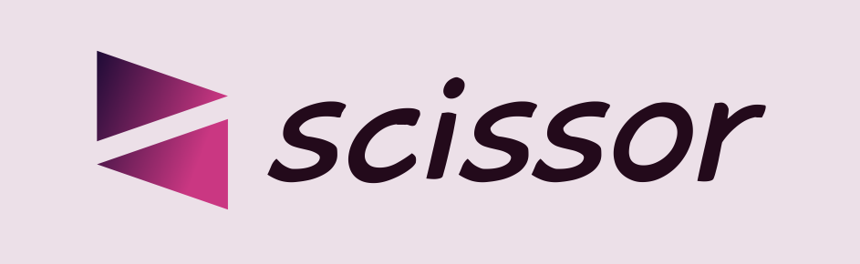

<!-- Back to Top Navigation Anchor -->
<a name="readme-top"></a>

<!-- Project Shields -->
<div align="center">

  [![Contributors][contributors-shield]][contributors-url]
  [![Forks][forks-shield]][forks-url]
  [![Stargazers][stars-shield]][stars-url]
  [![Issues][issues-shield]][issues-url]
  [![MIT License][license-shield]][license-url]
  [![Twitter][twitter-shield]][twitter-url]
</div>

<!-- Project Logo -->
<br />
<div align="center">
  <a href="https://sciz.site">
    
  </a>
</div>

<br />

<div>
  <p align="center">
    <a href="https://github.com/Ze-Austin/scissor/wiki"><strong>Explore the docs »</strong></a>
    <br />
    <br />
    <a href="#sample">View Demo</a>
    ·
    <a href="https://github.com/Ze-Austin/scissor/issues">Report Bug</a>
    ·
    <a href="https://github.com/Ze-Austin/scissor/issues">Request Feature</a>
  </p>
</div>

---

<!-- Table of Contents -->
<details>
  <summary>Table of Contents</summary>
  <ol>
    <li>
      <a href="#about-scissor">About Scissor</a>
      <ul>
        <li><a href="#built-with">Built With</a></li>
      </ul>
    </li>
    <li>
      <a href="#lessons-learned">Lessons Learned</a>
    </li>
    <li>
      <a href="#usage">Usage</a>
      <ul>
        <li><a href="#live-link">Live Link</a></li>
        <li>
          <a href="#localhost">Localhost</a>
          <ul>
            <li><a href="#prerequisites">Prerequisites</a></li>
            <li><a href="#installation">Installation</a></li>
          </ul>
        </li>
      </ul>
    </li>    
    <li><a href="#sample">Sample</a></li>
    <li><a href="#license">License</a></li>
    <li><a href="#contact">Contact</a></li>
    <li><a href="#acknowledgements">Acknowledgements</a></li>
  </ol>
  <p align="right"><a href="#readme-top">back to top</a></p>
</details>

---

<!-- About the Tool -->
## About Scissor

Scissor is a simple tool which makes URLs as short as possible, as "brief is the new black" in the age of social media.

Scissor converts long URLs into easily sharable QR codes and short, customizable links.

This tool was built as a capstone project by <a href="https://www.github.com/Ze-Austin">Ze Austin</a>, a Backend Engineering student at <a href="https://altschoolafrica.com/schools/engineering">AltSchool Africa</a> who's learning to create magic with Python.

Live Site: [sciz.site](https://www.sciz.site)

Full Documentation: [Scissor Wiki](https://github.com/Ze-Austin/scissor/wiki)

<p align="right"><a href="#readme-top">back to top</a></p>

### Built With:

![Python][python]
![Flask][flask]
![Jinja][jinja]
![HTML5][html5]
![CSS3][css3]
![SQLite][sqlite]

<p align="right"><a href="#readme-top">back to top</a></p>

---
<!-- Lessons from the Project -->
## Lessons Learned

Creating this tool helped to learn and practice:
* Responsive Web Design
* URL Shortening
* QR Code Generation
* Rate Limiting
* Caching
* Debugging
* Routing
* Database Management
* Internet Security
* User Authentication
* User Authorization
* Message Flashing
* Documentation

<p align="right"><a href="#readme-top">back to top</a></p>

---

<!-- Getting Started -->
## Usage

This tool can be accessed via the deployed site or a local copy of the project.

### Live Link

Deployed site: [sciz.site](https://www.sciz.site) - hosted via [render](https://www.render.com) 

### Localhost

To get a local copy up and running, follow the steps below.

#### Prerequisites

Python3: [Get Python](https://www.python.org/downloads/)

#### Installation

1. Clone this repo
   ```sh
   git clone https://github.com/Ze-Austin/scissor.git
   ```
2. Activate the virtual environment
   ```sh
   source scissor/bin/activate
   ```
3. Install project packages
   ```sh
   pip install -r requirements.txt
   ```
4. Run Flask
   ```sh
   flask run
   ```
5. Open the link generated in the terminal on a browser  

<p align="right"><a href="#readme-top">back to top</a></p>

---

<!-- Sample Screenshot -->
## Sample

<br />

[![Scissor Screenshot][scissor-screenshot]](https://github.com/Ze-Austin/scissor/blob/main/website/static/screenshots/scissor.png)

<br/>

---

<br/>

[![Dashboard Screenshot][dashboard-screenshot]](https://github.com/Ze-Austin/scissor/blob/main/website/static/screenshots/dashboard.png)

<br/>

<p align="right"><a href="#readme-top">back to top</a></p>

---

<!-- License -->
## License

Distributed under the MIT License. See <a href="https://github.com/Ze-Austin/scissor/blob/main/LICENSE">LICENSE</a> for more information.

<p align="right"><a href="#readme-top">back to top</a></p>

---

<!-- Contact -->
## Contact

Dr Austin Wopara - [@Ze_Austin](https://twitter.com/Ze_Austin) - austinwopara@gmail.com

Live Site: [sciz.site](https://www.sciz.site)

Project Link: [Scissor Repo](https://github.com/Ze-Austin/scissor)

Documentation: [Scissor Wiki](https://github.com/Ze-Austin/scissor/wiki)

<p align="right"><a href="#readme-top">back to top</a></p>

---

<!-- Acknowledgements -->
## Acknowledgements

This project was made possible by:

* [AltSchool Africa School of Engineering](https://altschoolafrica.com/schools/engineering)
* [Caleb Emelike's Flask Lessons](https://github.com/CalebEmelike)
* [My AltSchool Python Repo](https://github.com/Ze-Austin/altschool-python)
* [GitHub Student Pack](https://education.github.com/globalcampus/student)
* [namecheap](https://www.namecheap.com)
* [Othneil Drew's README Template](https://github.com/othneildrew/Best-README-Template)
* [Ileriayo's Markdown Badges](https://github.com/Ileriayo/markdown-badges)
* [Stack Overflow](https://stackoverflow.com/)

<p align="right"><a href="#readme-top">back to top</a></p>

---

<!-- Markdown Links & Images -->
[contributors-shield]: https://img.shields.io/github/contributors/Ze-Austin/scissor.svg?style=for-the-badge
[contributors-url]: https://github.com/Ze-Austin/scissor/graphs/contributors
[forks-shield]: https://img.shields.io/github/forks/Ze-Austin/scissor.svg?style=for-the-badge
[forks-url]: https://github.com/Ze-Austin/scissor/network/members
[stars-shield]: https://img.shields.io/github/stars/Ze-Austin/scissor.svg?style=for-the-badge
[stars-url]: https://github.com/Ze-Austin/scissor/stargazers
[issues-shield]: https://img.shields.io/github/issues/Ze-Austin/scissor.svg?style=for-the-badge
[issues-url]: https://github.com/Ze-Austin/scissorissues
[license-shield]: https://img.shields.io/github/license/Ze-Austin/scissor.svg?style=for-the-badge
[license-url]: https://github.com/Ze-Austin/scissor/blob/main/LICENSE.txt
[twitter-shield]: https://img.shields.io/badge/-@ze_austin-1ca0f1?style=for-the-badge&logo=twitter&logoColor=white&link=https://twitter.com/ze_austin
[twitter-url]: https://twitter.com/ze_austin
[scissor-screenshot]: website/static/screenshots/scissor.png
[dashboard-screenshot]: website/static/screenshots/dashboard.png
[python]: https://img.shields.io/badge/python-3670A0?style=for-the-badge&logo=python&logoColor=ffdd54
[flask]: https://img.shields.io/badge/flask-%23000.svg?style=for-the-badge&logo=flask&logoColor=white
[jinja]: https://img.shields.io/badge/jinja-white.svg?style=for-the-badge&logo=jinja&logoColor=black
[html5]: https://img.shields.io/badge/html5-%23E34F26.svg?style=for-the-badge&logo=html5&logoColor=white
[css3]: https://img.shields.io/badge/css3-%231572B6.svg?style=for-the-badge&logo=css3&logoColor=white
[sqlite]: https://img.shields.io/badge/sqlite-%2307405e.svg?style=for-the-badge&logo=sqlite&logoColor=white